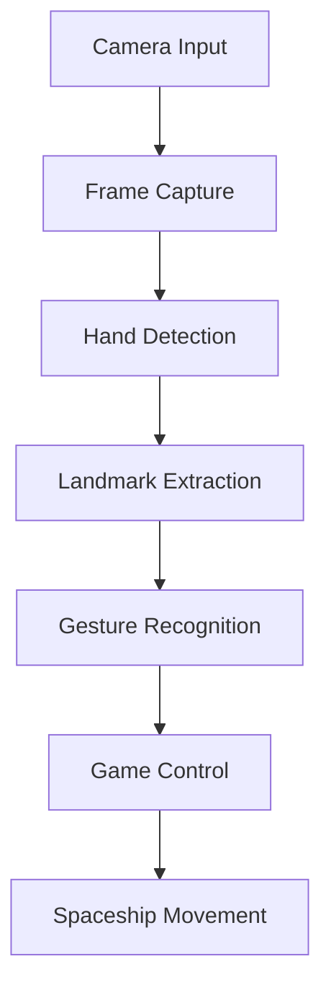

# 🚀 Spaceship Game - OpenCV Python

<div align="center">


<h3>🎮 An Interactive Gesture-Controlled Spaceship Adventure</h3>

[](https://python.org)
[](https://opencv.org)
[](https://pygame.org)
[](https://numpy.org)

<p align="center">
  
</p>

</div>

---

## 🌟 Features

<div align="center">
  <table>
    <tr>
      <td align="center" width="33%">
        
        <h3>🤚 Gesture Control</h3>
        <p>Control your spaceship with intuitive hand gestures using computer vision</p>
      </td>
      <td align="center" width="33%">
        
        <h3>⚡ Real-time Processing</h3>
        <p>Smooth and responsive gameplay with optimized OpenCV algorithms</p>
      </td>
      <td align="center" width="33%">
        
        <h3>🎯 Immersive Experience</h3>
        <p>Engaging visuals and sound effects for an epic gaming experience</p>
      </td>
    </tr>
  </table>
</div>

## 🛸 Game Features

- 🎯 **Gesture-Based Control**: Navigate your spaceship using hand movements
- 🔫 **Dynamic Shooting**: Fire lasers with specific gestures
- 👾 **Enemy AI**: Smart enemies with varying difficulty levels
- 💥 **Collision Detection**: Realistic physics and collision system
- 🏆 **Scoring System**: Track your progress and achievements
- 🎵 **Sound Effects**: Immersive audio experience
- 📊 **Real-time Stats**: Live performance monitoring

## 🛠️ Tech Stack

<div align="center">

### Core Technologies

<table>
  <tr>
    <td align="center">
      
      <br><b>Python 3.8+</b>
      <br>Main programming language
    </td>
    <td align="center">
      
      <br><b>OpenCV 4.5+</b>
      <br>Computer vision & image processing
    </td>
    <td align="center">
      
      <br><b>Pygame 2.0+</b>
      <br>Game development framework
    </td>
    <td align="center">
      
      <br><b>NumPy</b>
      <br>Numerical computations
    </td>
  </tr>
</table>

### Additional Libraries

| Library | Version | Purpose |
|---------|---------|---------|
| **MediaPipe** | `0.8.10+` | Hand landmark detection |
| **Pygame** | `2.0+` | Game engine and graphics |
| **NumPy** | `1.21+` | Array operations and math |
| **OpenCV** | `4.5+` | Image processing and camera |

</div>

## 🚀 Quick Start

<div align="center">
  
</div>

### Prerequisites

```bash
# Ensure you have Python 3.8+ installed
python --version
```

### Installation

1. **Clone the repository**
   ```bash
   git clone https://github.com/abhinav29102005/spaceship-game-opencv-python.git
   cd spaceship-game-opencv-python
   ```

2. **Create virtual environment** (recommended)
   ```bash
   python -m venv spaceship_env
   
   # On Windows
   spaceship_env\Scripts\activate
   
   # On macOS/Linux
   source spaceship_env/bin/activate
   ```

3. **Install dependencies**
   ```bash
   pip install -r requirements.txt
   ```

4. **Launch the game**
   ```bash
   python main.py
   ```

## 🎮 How to Play

<div align="center">
  
</div>

### Gesture Controls

| Gesture | Action | Description |
|---------|--------|-------------|
| ✋ **Open Palm** | Move | Move spaceship left/right based on hand position |
| 👆 **Index Finger Up** | Shoot | Fire laser bullets |
| ✊ **Closed Fist** | Pause | Pause/unpause the game |
| 🤞 **Peace Sign** | Special Attack | Activate power-up mode |

### Game Mechanics

- **Health**: Start with 100 HP, lose health on enemy contact
- **Score**: Gain points by destroying enemies
- **Levels**: Progress through increasingly difficult levels
- **Power-ups**: Collect special items for enhanced abilities

## 📁 Project Structure

```
spaceship-game-opencv-python/
├── 📁 assets/                  # Game assets
│   ├── 🖼️ images/             # Sprite images
│   ├── 🎵 sounds/             # Audio files
│   └── 🎬 animations/         # Animation files
├── 📁 src/                     # Source code
│   ├── 🎮 game/               # Game logic
│   ├── 👁️ vision/             # Computer vision modules
│   └── 🔧 utils/              # Utility functions
├── 📁 tests/                   # Unit tests
├── 📋 requirements.txt         # Dependencies
├── 🚀 main.py                 # Main game file
└── 📖 README.md               # This file
```

## 🔧 Configuration

### Camera Settings
```python
# config.py
CAMERA_CONFIG = {
    'width': 640,
    'height': 480,
    'fps': 30,
    'device_id': 0
}
```

### Game Settings
```python
GAME_CONFIG = {
    'screen_width': 800,
    'screen_height': 600,
    'fps': 60,
    'difficulty': 'medium'
}
```

## 🎯 Game Mechanics Deep Dive

### Computer Vision Pipeline



### Gesture Recognition Algorithm

1. **Hand Detection**: Uses MediaPipe for real-time hand tracking
2. **Landmark Analysis**: Processes 21 hand landmarks
3. **Gesture Classification**: Custom algorithm for gesture recognition
4. **Smoothing**: Applies filters to reduce jitter
5. **Game Integration**: Translates gestures to game actions

## 📊 Performance Metrics

<div align="center">
  
</div>

### System Requirements

| Component | Minimum | Recommended |
|-----------|---------|-------------|
| **CPU** | Intel i3 / AMD Ryzen 3 | Intel i5 / AMD Ryzen 5 |
| **RAM** | 4GB | 8GB+ |
| **GPU** | Integrated | Dedicated GPU |
| **Camera** | 480p webcam | 720p+ webcam |
| **OS** | Windows 10/macOS 10.15/Ubuntu 18.04 | Latest versions |

## 🐛 Troubleshooting

### Common Issues

<details>
<summary><b>🚫 Camera not detected</b></summary>

```bash
# Check camera permissions
# Windows: Settings > Privacy > Camera
# macOS: System Preferences > Security & Privacy > Camera
# Linux: Check /dev/video* devices
```
</details>

<details>
<summary><b>📉 Low FPS performance</b></summary>

```python
# Reduce camera resolution in config.py
CAMERA_CONFIG['width'] = 480
CAMERA_CONFIG['height'] = 360
```
</details>

<details>
<summary><b>🤚 Gesture recognition issues</b></summary>

- Ensure good lighting conditions
- Keep hand within camera frame
- Avoid background clutter
- Calibrate gesture sensitivity in settings
</details>

## 🤝 Contributing

<div align="center">
  
</div>

We welcome contributions! Here's how you can help:

1. 🍴 **Fork the repository**
2. 🌱 **Create a feature branch**: `git checkout -b feature/amazing-feature`
3. 💻 **Make your changes** and add tests
4. 📝 **Commit your changes**: `git commit -m 'Add amazing feature'`
5. 🚀 **Push to the branch**: `git push origin feature/amazing-feature`
6. 🔄 **Open a Pull Request**

### Development Guidelines

- Follow PEP 8 style guidelines
- Add unit tests for new features
- Update documentation as needed
- Test on multiple platforms

## 📈 Roadmap

- [ ] 🎯 Advanced gesture recognition
- [ ] 🌍 Multiplayer support
- [ ] 📱 Mobile app version
- [ ] 🤖 AI-powered enemies
- [ ] 🎨 Enhanced graphics and animations
- [ ] 🏆 Achievement system
- [ ] 📊 Analytics dashboard

## 📸 Screenshots & Demos

<div align="center">

### Gameplay Demo


### Gesture Recognition in Action


</div>


## 👨‍💻 Author

<div align="center">
  
  
  <h3>Abhinav Singh</h3>
  
  <p align="center">
    <a href="https://linkedin.com/in/bigboyaks">
      
    </a>
    <a href="mailto:asingh3_be24@thapar.edu">
      
    </a>
    <a href="https://github.com/abhinav29102005">
      
    </a>
  </p>
</div>

## 🙏 Acknowledgments

- **OpenCV Community** for the amazing computer vision library
- **MediaPipe Team** for hand tracking technology
- **Pygame Community** for the game development framework
- **Python Software Foundation** for the incredible programming language

---

<div align="center">

### 🎮 Ready to Play?

<p>
  
</p>

**⭐ Star this repository if you found it helpful!**


</div>
